# Odin Bindings for libtess2
Odin bindings for [libtess2](https://github.com/memononen/libtess2/tree/master), a port of the GLU tessellator: a scanline tessellator useful for polygon boolean operations and offsetting.

## Setup
Clone this repository into your Odin project, then run the included build script from the `source/` directory:
```sh
cd source
./build_libtess2.sh      # macOS / Linux
build_libtess2.bat       # Windows (Developer Command Prompt)
```
This will pull in the libtess2 source, patch it to enable double precision, and compile it to `bin/`.

## Usage

### Convenience API
The simplest way to use the library. Each call creates and destroys a tessellator internally.

```odin
import tess "path/to/libtess2"

polygon := [][2]f64{
    {0, 0}, {100, 0}, {100, 100}, {0, 100},
}

// Boolean operations — pass a slice of polygons
union  := tess.union_polygons({polygon_a, polygon_b})
defer tess.delete_contours(union)

diff   := tess.difference_polygons({polygon_a, polygon_b})
defer tess.delete_contours(diff)

isect  := tess.intersect_polygons({polygon_a, polygon_b})
defer tess.delete_contours(isect)

xor    := tess.xor_polygons({polygon_a, polygon_b})
defer tess.delete_contours(xor)

// Uniform offset — join type baked into the call name
inset_round := tess.offset_polygon_round(polygon, {-10.0}, arc_resolution = 0.5)
defer tess.delete_contours(inset_round)

inset_miter := tess.offset_polygon_miter(polygon, {-10.0}, miter_limit = 2.0)
defer tess.delete_contours(inset_miter)

inset_bevel := tess.offset_polygon_bevel(polygon, {-10.0})
defer tess.delete_contours(inset_bevel)

// Per-edge offset — one delta per edge, last value is reused for remaining edges
deltas := []f64{-5, -20, -5, -5}
inset2 := tess.offset_polygon_round(polygon, deltas, arc_resolution = 0.5)
defer tess.delete_contours(inset2)

// Results are [][][2]f64 — a slice of contours, each a slice of vertices
for contour in inset_round {
    for vertex in contour {
        fmt.println(vertex)
    }
}
```

### Join Types

| Function | Description | Extra parameter |
|---|---|---|
| `offset_polygon_round` | Arc join, chord-deviation controlled | `arc_resolution: f64` |
| `offset_polygon_miter` | Sharp point join, with spike limit | `miter_limit: f64` |
| `offset_polygon_bevel` | Straight cut join | — |

All three accept either a single uniform delta `{-10.0}` or a per-edge delta slice. Negative delta shrinks, positive expands.

**arc_resolution** is a chord deviation tolerance in the same units as your geometry. A value of `0.5` works well for geometry in the 50–150 unit range. Smaller values produce smoother arcs at the cost of more vertices.

**miter_limit** caps how far a miter spike can extend from the original vertex, expressed as a multiple of the offset delta. When exceeded, the join falls back to bevel. `2.0` is conservative (Clipper default), `4.0` is more permissive (SVG default).

### Knobby API
For full control, use `offset_polygon_edges` directly. This is useful when you need per-edge deltas with heterogeneous signs and want to explicitly declare whether the contour is being inset or outset.

```odin
// All knobs exposed — most callers should prefer the named wrappers above
result := tess.offset_polygon_edges(
    polygon,
    deltas,
    join_type      = .Round,
    arc_resolution = 0.5,
    miter_limit    = 2.0,
    allocator      = context.allocator,
)
defer tess.delete_contours(result)
```

### Stack-based API
For performance-sensitive code, reuse a tessellator across multiple operations by pushing contours and tessellating in sequence.

```odin
import tess "path/to/libtess2"

polygon_a := [][2]f64{ {-60,-60},{60,-60},{60,60},{-60,60} }
polygon_b := [][2]f64{ {-30,-30},{90,-30},{90,90},{-30,90} }

ctx, ok := tess.begin(2)  // 2 = [2]f64 vertices
if !ok do return
defer tess.end(ctx)

tess.add(ctx, polygon_a)
tess.add(ctx, polygon_b)

// .Positive  → union
// .Abs_Geq_Two → intersection
// .Odd → XOR
contours := tess.tesselate_boundary_contours(&ctx, .Positive)
defer tess.delete_contours(contours)

for c in contours {
    fmt.println("contour:", c)
}
```

### Stack-based API — triangles and quads
```odin
ctx, ok := tess.begin(2, use_delaunay = true)
if !ok do return
defer tess.end(ctx)

tess.add(ctx, polygon)

// triangles — returns [][3][2]f64
tris := tess.tesselate_polygons(&ctx, .Positive, 3)
defer delete(tris)

for tri in tris {
    draw_triangle(tri[0], tri[1], tri[2])
}

// quads — libtess2 merges adjacent triangles into quads where possible
// degenerate quads (triangles) have their 4th vertex duplicated
quads := tess.tesselate_polygons(&ctx, .Positive, 4)
defer delete(quads)

for quad in quads {
    draw_quad(quad[0], quad[1], quad[2], quad[3])
}
```

### Stack-based API — 3D tessellation
```odin
ctx, ok := tess.begin(3)
if !ok do return
defer tess.end(ctx)

polygon_3d := [][3]f64{
    {0, 0, 0}, {100, 0, 0}, {100, 0, 100}, {0, 0, 100},
}
tess.add(ctx, polygon_3d)

normal := [3]f64{0, 1, 0}
contours := tess.tesselate_boundary_contours(&ctx, .Positive, normal = &normal[0])
defer tess.delete_contours(contours)
```

### Winding rules

| Rule | Effect |
|---|---|
| `.Odd` | XOR — alternating inside/outside (standard fill rule) |
| `.Nonzero` | Union of all contours |
| `.Positive` | Regions with winding > 0 |
| `.Negative` | Regions with winding < 0 |
| `.Abs_Geq_Two` | Intersection — regions covered by 2 or more contours |

## Polygon Operations

| Function | Description |
|---|---|
| `offset_polygon_round` | Offset with arc joins, chord-deviation controlled |
| `offset_polygon_miter` | Offset with miter joins, spike-limited |
| `offset_polygon_bevel` | Offset with straight-cut joins |
| `offset_polygon_edges` | Full knobby API — all parameters exposed |
| `union_polygons` | Boolean union |
| `difference_polygons` | Boolean difference |
| `intersect_polygons` | Boolean intersection |
| `xor_polygons` | Boolean symmetric difference |

---

## Examples

### L shape — uniform offset
| Round in | Miter in | Bevel in |
|---|---|---|
| 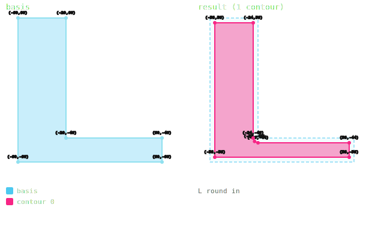 | 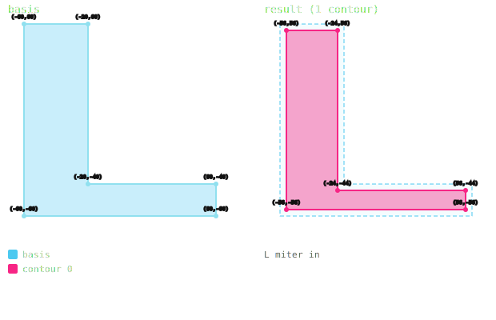 |  |

| Round out | Miter out | Bevel out |
|---|---|---|
|  |  | 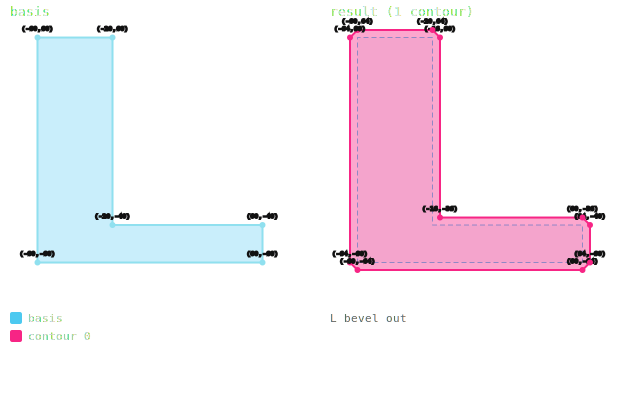 |

### L shape — collapse & per-edge
| Round collapse | Miter collapse | Bevel collapse |
|---|---|---|
| 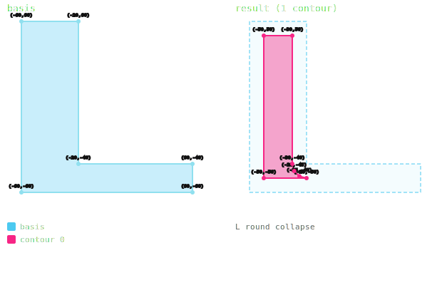 | 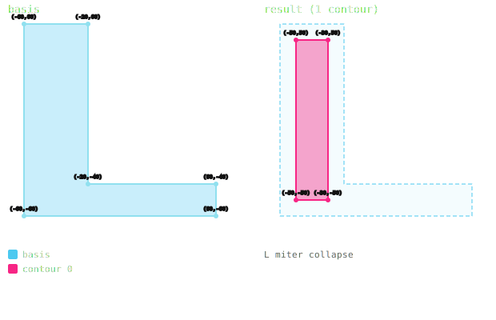 | 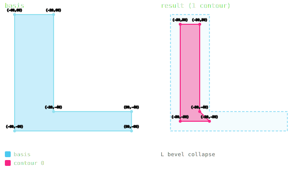 |

| Round per-edge | Miter per-edge | Bevel per-edge |
|---|---|---|
| 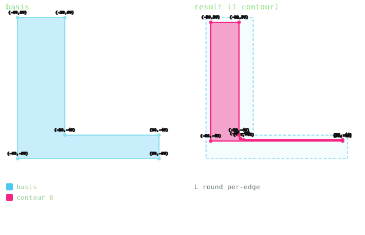 | 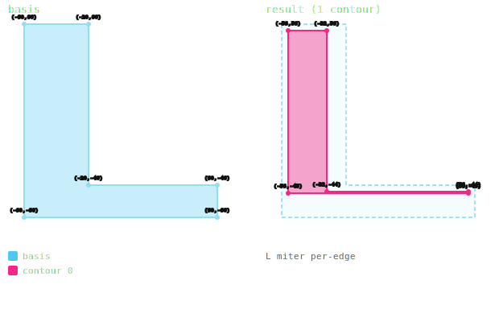 |  |

---

### H shape — uniform offset
| Round in | Miter in | Bevel in |
|---|---|---|
| 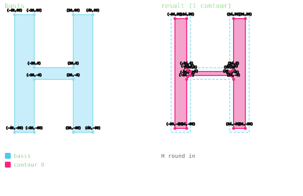 | 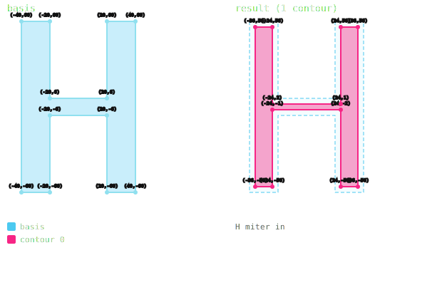 |  |

| Round out | Miter out | Bevel out |
|---|---|---|
| 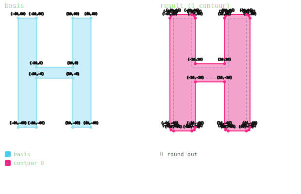 | 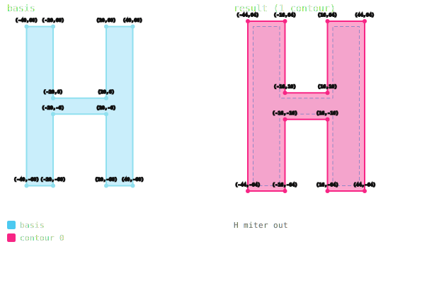 | 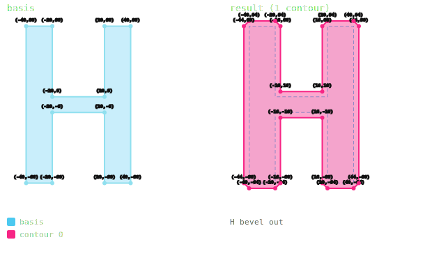 |

### H shape — collapse & per-edge
| Round collapse | Miter collapse | Bevel collapse |
|---|---|---|
|  | 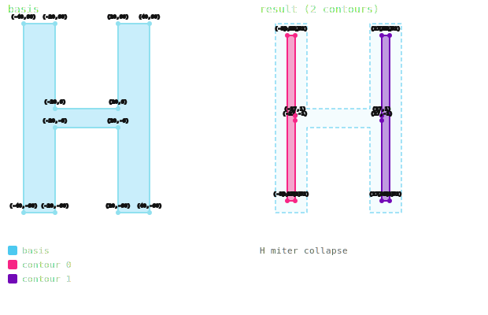 |  |

| Round per-edge | Miter per-edge | Bevel per-edge |
|---|---|---|
| 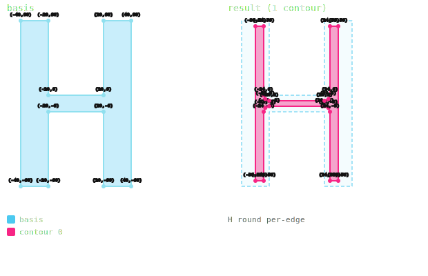 | 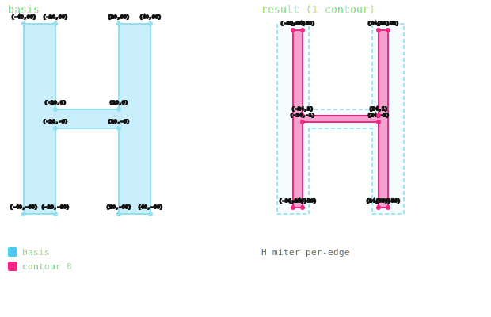 | 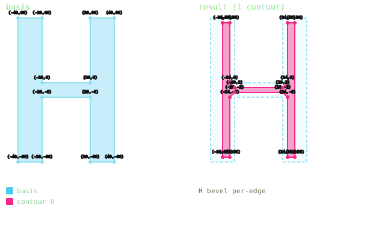 |

---

### Bowtie — offset & per-edge
| Round out | Miter out | Bevel out |
|---|---|---|
| 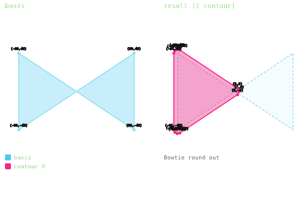 | 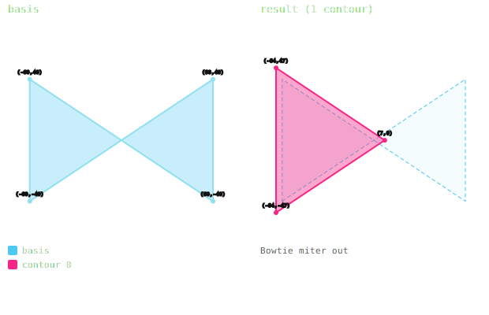 | 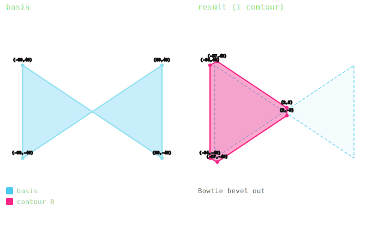 |

| Round per-edge | Miter per-edge | Bevel per-edge |
|---|---|---|
| 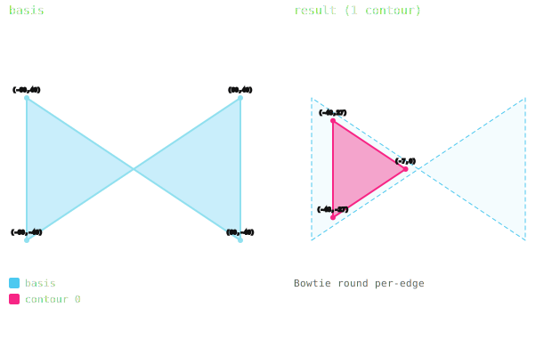 |  |  |

---

## Notes & Limitations
- Per-edge deltas with heterogeneous signs (some edges expanding, some shrinking) is undefined
- Open polygon offsetting is not yet supported

## Roadmap
- Explicit inward/outward treatment for heterogeneous signed edge deltas
- Open polygon offsetting
- Open polygon booleans
- Boolean trees