# Odin Bindings for libtess2
Odin bindings for [libtess2](https://github.com/memononen/libtess2/tree/master), a port of the GLU tessellator: a scanline tessellator useful for polygon boolean operations and offsetting.

## Setup
Clone this repository into your Odin project, then run the included build script from the `source/` directory:
```sh
cd source
./build_libtess2.sh      # macOS / Linux
build_libtess2.bat       # Windows (Developer Command Prompt)
```
This will pull in the libtess2 source, patch it to enable double precision, and compile it to `bin/`.

## Usage

### Convenience API
The simplest way to use the library. Each call creates and destroys a tessellator internally.

```odin
import tess "path/to/libtess2"

polygon := [][2]f64{
    {0, 0}, {100, 0}, {100, 100}, {0, 100},
}

// Boolean operations — pass a slice of polygons
union  := tess.union_polygons({polygon_a, polygon_b})
defer tess.delete_contours(union)

diff   := tess.difference_polygons({polygon_a, polygon_b})
defer tess.delete_contours(diff)

isect  := tess.intersect_polygons({polygon_a, polygon_b})
defer tess.delete_contours(isect)

xor    := tess.xor_polygons({polygon_a, polygon_b})
defer tess.delete_contours(xor)

// Uniform inward offset
inset := tess.offset_polygon(polygon, -10.0)
defer tess.delete_contours(inset)

// Per-edge offset — one delta per edge, last value is the fallback
deltas := []f64{-5, -20, -5, -5}
inset2 := tess.offset_polygon_edges(polygon, deltas)
defer tess.delete_contours(inset2)

// Results are [][][2]f64 — a slice of contours, each a slice of vertices
for contour in inset {
    for vertex in contour {
        fmt.println(vertex)
    }
}
```

### Stack-based API
For performance-sensitive code, reuse a tessellator across multiple operations by pushing contours and tessellating in sequence.

```odin
import tess "path/to/libtess2"

polygon_a := [][2]f64{ {-60,-60},{60,-60},{60,60},{-60,60} }
polygon_b := [][2]f64{ {-30,-30},{90,-30},{90,90},{-30,90} }

// begin creates a typed tessellator — vertex size is a compile-time constant
ctx, ok := tess.begin(2)  // 2 = [2]f64 vertices
if !ok do return
defer tess.end(ctx)

// push as many contours as needed
tess.add(ctx, polygon_a)
tess.add(ctx, polygon_b)

// tessellate with a winding rule to get boundary contours
// .Positive  → union
// .Abs_Geq_Two → intersection
// .Negative  → (with appropriate input orientation)
contours := tess.tesselate_boundary_contours(&ctx, .Positive)
defer tess.delete_contours(contours)

for c in contours {
    fmt.println("contour:", c)
}
```

### Stack-based API — triangles and quads
```odin
ctx, ok := tess.begin(2, use_delaunay = true)
if !ok do return
defer tess.end(ctx)

tess.add(ctx, polygon)

// triangles — returns [][3][2]f64
tris := tess.tesselate_polygons(&ctx, .Positive, 3)
defer delete(tris)

for tri in tris {
    draw_triangle(tri[0], tri[1], tri[2])
}

// quads — libtess2 merges adjacent triangles into quads where possible
// degenerate quads (triangles) have their 4th vertex duplicated
quads := tess.tesselate_polygons(&ctx, .Positive, 4)
defer delete(quads)

for quad in quads {
    draw_quad(quad[0], quad[1], quad[2], quad[3])
}
```

### Stack-based API — 3D tessellation
For geometry that lives on an arbitrary plane in 3D, pass `vertex_size = 3` and set a plane normal. libtess2 will project all contours onto that plane for tessellation.

```odin
// tessellate a polygon on the XZ plane (normal pointing up in Y)
ctx, ok := tess.begin(3)
if !ok do return
defer tess.end(ctx)

polygon_3d := [][3]f64{
    {0, 0, 0}, {100, 0, 0}, {100, 0, 100}, {0, 0, 100},
}
tess.add(ctx, polygon_3d)

normal := [3]f64{0, 1, 0}
contours := tess.tesselate_boundary_contours(&ctx, .Positive, normal = &normal[0])
defer tess.delete_contours(contours)
```

### Winding rules
Winding rules control which regions are considered interior. They can be used to implement all boolean operations:

| Rule | Effect |
|---|---|
| `.Odd` | XOR — alternating inside/outside (standard fill rule) |
| `.Nonzero` | Union of all contours |
| `.Positive` | Regions with winding > 0 |
| `.Negative` | Regions with winding < 0 |
| `.Abs_Geq_Two` | Intersection — regions covered by 2 or more contours |

## Polygon Operations
The following convenience operations are provided in `polygon.odin`:

| Function | Description |
|---|---|
| `offset_polygon` | Offsets all edges of a polygon by a uniform delta |
| `offset_polygon_edges` | Offsets each edge of a polygon by an individual delta |
| `union_polygons` | Boolean union |
| `difference_polygons` | Boolean difference |
| `intersect_polygons` | Boolean intersection |
| `xor_polygons` | Boolean symmetric difference |

## Examples
These include a few pathologies, but mostly normal

### Offset: Concave Shapes
| Offset in -6 | Per-edge offset | Offset out +6 |
|---|---|---|
| 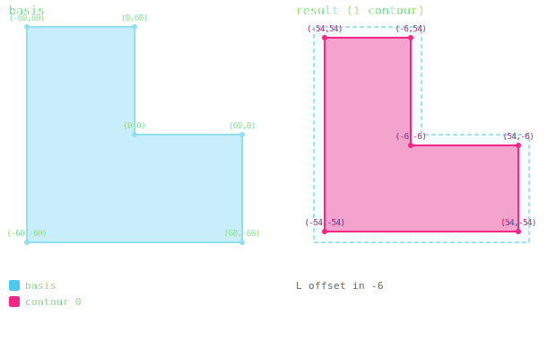 | 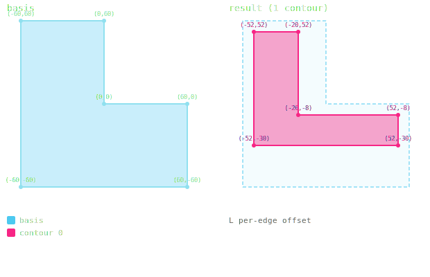 | 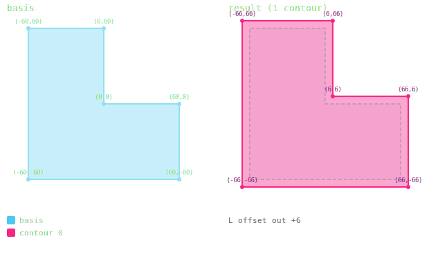 |

### Offset: Collapse
| L arm collapse -30 | U channel collapse |
|---|---|
| 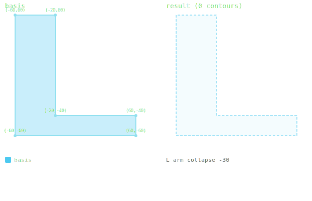 | 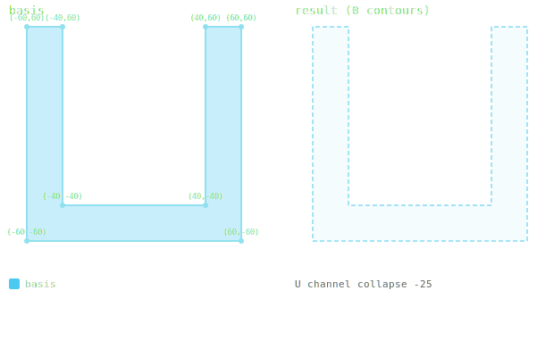 |

### Offset: Split & Partial Collapse
| H split → 2 shapes | L arm partial collapse |
|---|---|
| 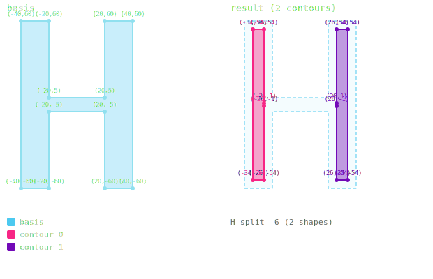 | 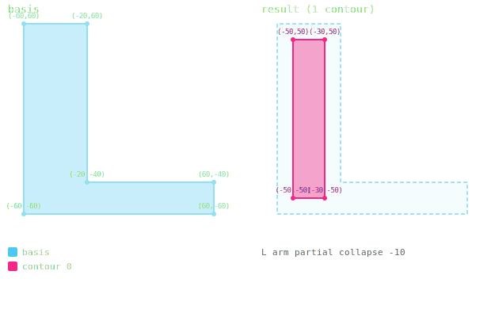 |

### Offset: Thin geometry
| Thin rect near-collapse | Thin rect gone | U-shape offset |
|---|---|---|
| 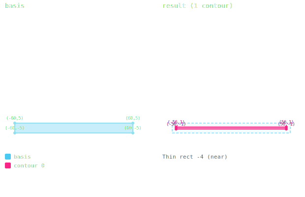 | 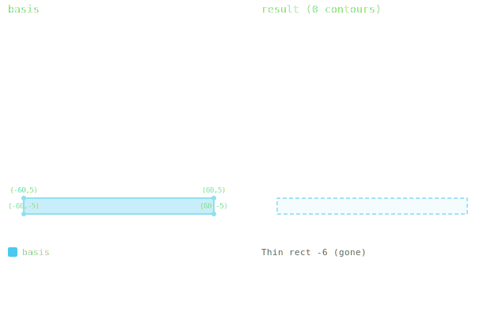 | 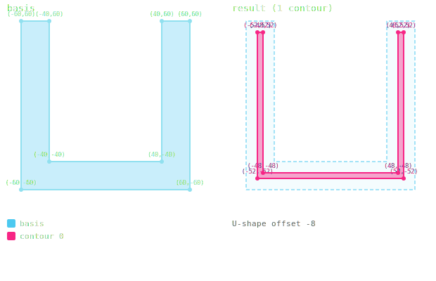 |

### Offset: Complex shapes
| Star -8 | Cross -8 |
|---|---|
| 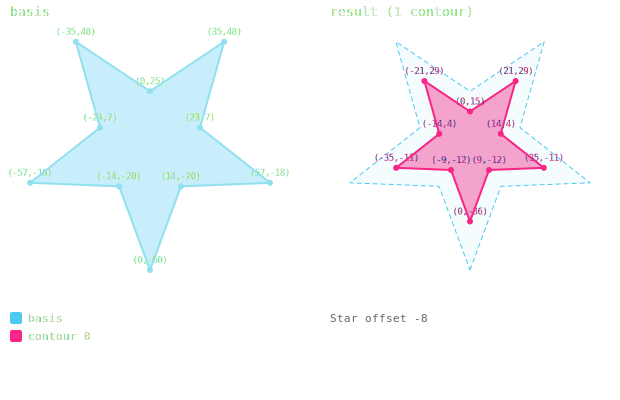 | 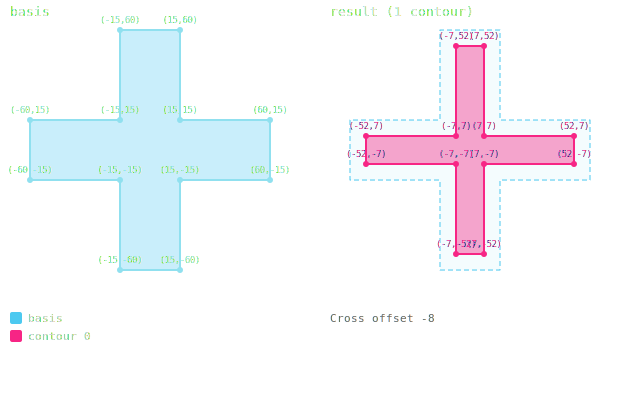 |

## Notes & Limitations
- Offsets are currently mitered only with no miter limit

## Roadmap
- Selectable join types: round, bevel, miter
- Constraints on miters and arc resolution
- Open polygon offsetting
- Open polygon booleans
- Boolean trees